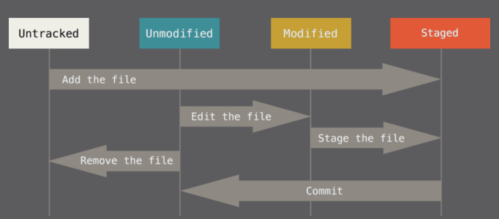
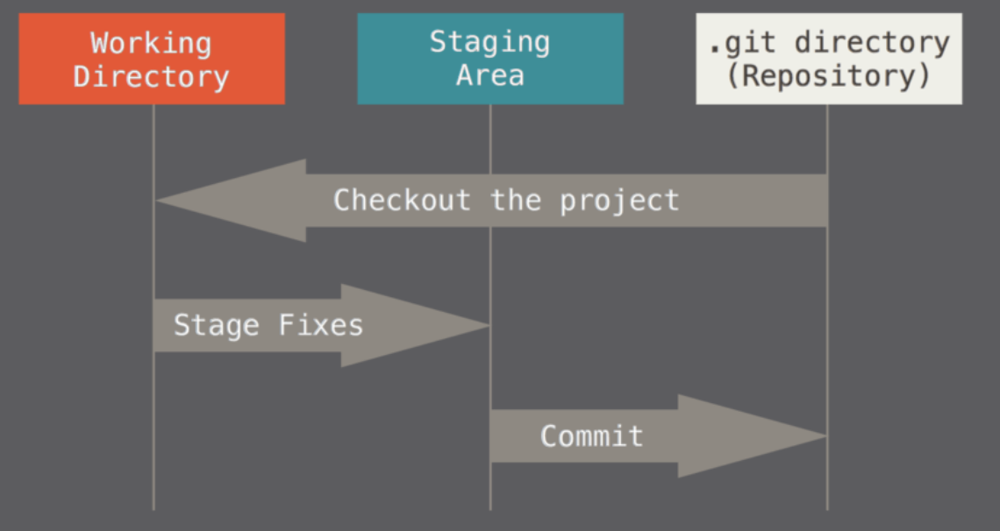

# 基础

## git 相关工具

[tig](https://jonas.github.io/tig/)

## 初始化

```sh
git config --global user.name "your name"
git config --global user.email "yourEmail@example.com"
```

## 文件的状态

- 未跟踪(untracked)
- 已跟踪(tracked)
  - 未修改(unmodified)
  - 已修改(modified)
  - 已暂存(staged)
  - 已提交(committed)

> 未修改和已提交本质上是同一种状态



## 三个工作区域

- 工作目录(Working Directory)
- 暂存区域(Staging Area)
- 仓库(Repository)



## gitignore

1. 开头结尾皆无 `/`, 表示忽略所有符合规则的文件或目录

2. 以 `/` 结尾表示忽略目录, `dist/` 即忽略所有 dist 目录

3. 以 `/` 开头表示忽略相对于根目录的目标, `/.setting` 即忽略根目录下的 .setting 文件, `/dist/` 即忽略根目录下的 dist 目录

4. `!` 开头表示取反, 即忽略指定模式以外的文件或目录

### glob

1. `*` 匹配任意数量的任意字符

   `Law*`, 匹配 `Law`, `Laws`, `Lawyer`, 但不匹配 `GrokLaw`, `La`, `aw`

2. `?` 匹配任意一个字符

   `?at` 匹配 `Cat`, `cat`, `Bat`, `bat`, 但不匹配 `at`

3. `[]` 匹配给定字符集里的一个字符

   `[CB]at` 匹配 `Cat`, `Bat`, 但不匹配 `cat`, `bat`

## 查看提交信息(git log)

- `-p` 用来显示每次提交的内容差异
- `-n` n 为数字, 意味着仅显示最近 n 次提交
- `--stat` 查看每次提交的简略统计信息

## 修改最新提交的信息

```sh
git commit --amend --only
# or
git commit --amend --only -m 'xxxxxxx'
```

## 回滚(git reset)

```sh
# 回滚, 并忽略所有改动
git reset commit-id --hard

# 回滚, 但暂存所有改动
git reset commit-id --soft
```

## 储藏(git stash)

储藏所有已跟踪文件的改动

```sh
# 储藏当前改动, 储藏信息为当前提交信息(commit message)
git stash [push]

# 储藏当前改动, 并指定储藏信息
git stash push 'message'

# 储藏当前改动(包括未跟踪的文件)
git stash push -u

# 仅储藏已暂存的文件
git stash push --keep-index
```

## 删除未追踪文件(git clean)

默认从当前目录删除

**-d**

Normally, when no \<path\> is specified, git clean will not recurse into untracked directories to avoid removing too much. Specify -d to have it recurse into such directories as well. If any paths are specified, -d is irrelevant; all untracked files matching the specified paths (with exceptions for nested git directories mentioned under `--force`) will be removed.

**-n**

Don’t actually remove anything, just show what would be done.

**-f**

If the Git configuration variable clean.requireForce is not set to false, **_git clean_** will refuse to delete files or directories unless given -f or -i. Git will refuse to modify untracked nested git **repositories** (directories with a .git **subdirectory**) unless a second -f is given.

**-X**

Remove only files ignored by Git. This may be useful to rebuild everything **from scratch**, but keep manually created files.
